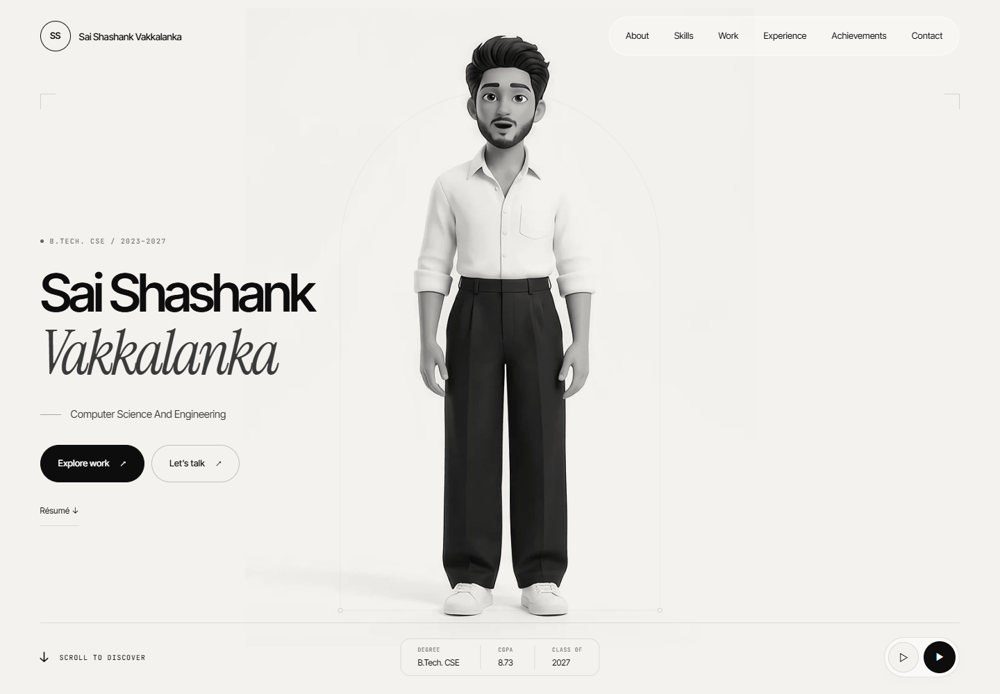
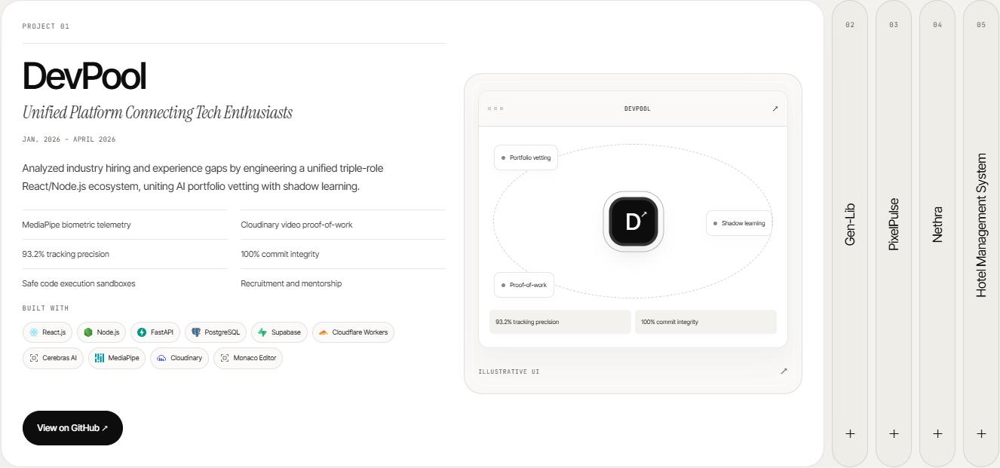
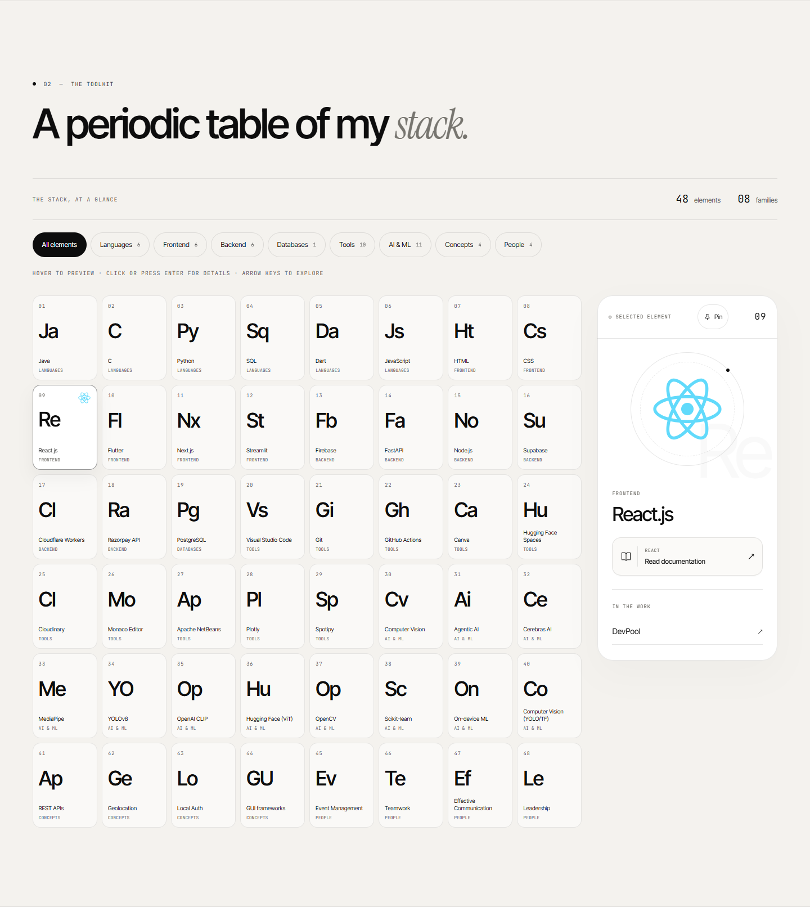

<div align="center">

**S S / PORTFOLIO**

# Sai Shashank Vakkalanka

### Quiet design. Thoughtful motion. Work in focus.

A personal portfolio built around paper tones, editorial typography,
an animated introduction, and a collection of interactive experiences.

**Next.js 15 · React 19 · TypeScript · Tailwind CSS 4 · Lenis**

[Explore the sections](#the-experience) · [Run locally](#quick-start) · [Customize](#make-it-your-own) · [Quality checks](#quality-and-verification)

[GitHub](https://github.com/SaiShashank-10) · [LinkedIn](https://www.linkedin.com/in/vakkalanka-sai-shashank/) · [Email](mailto:shashankvakkalanka@gmail.com) · [Résumé](public/resume.pdf)

</div>



> A continuous, light portfolio: no loading ceremony, no section curtains, and no WebGL. Each section has its own interaction while sharing the same calm visual language.

---

## At a glance

| 08 sections | 05 projects | 48 skill elements | 03 certifications |
| :---: | :---: | :---: | :---: |
| One continuous page | Résumé-backed work | Eight skill families | Interactive certificate folio |

Personal content is centralized in [`src/lib/data.ts`](src/lib/data.ts). Fonts, logos, video, portrait, and résumé are served locally. The app needs no API keys, environment variables, database, or external service to run.

## Quick start

Use **Node.js 22** and npm. Python and FFmpeg are only needed if you want to rebuild the media assets.

From the project directory:

```sh
npm install
npm run dev
```

Open [localhost:3000](http://localhost:3000).

For a production preview, stop the development server first:

```sh
npm run build
npm run start
```

For a clean, lockfile-based installation, use `npm ci` instead of `npm install`.

<details>
<summary><strong>Command reference</strong></summary>

| Command | Purpose |
| --- | --- |
| `npm run dev` | Start the development server on port 3000 |
| `npm run build` | Compile the production app; run build-time lint and type checks |
| `npm run start` | Serve an existing production build |
| `npm run lint` | Run ESLint with zero warnings allowed |
| `npm run typecheck` | Run TypeScript without emitting files |
| `npm run test:e2e` | Run Playwright against a separately started server |
| `node scripts/audit.mjs` | Generate mobile and desktop Lighthouse reports |
| `npm run assets -- --input assets/source-intro.mp4` | Rebuild hero assets with Python and FFmpeg |

</details>

## The experience

| Section | What you will find | Interaction |
| --- | --- | --- |
| **Hero** | Name, academic discipline, avatar video, résumé and contact entry points | Individual ghost-letter reveals; sound and playback controls; visibility-aware video |
| **01 / About** | Introduction, education, contact facts, and a hanging developer ID | Damped lanyard motion, smooth card flip, draggable strap, explicit Front/Reverse controls |
| **02 / Skills** | A periodic table of 48 skills across eight families | Filter chips, hover previews, pinned inspector, animated detail popup, documentation links |
| **03 / Work** | Five projects with descriptions, features, technologies, and repository links | Hover expansion, direct project index, previous/next controls, coordinated text and illustration entrances |
| **04 / Certifications** | Three résumé-listed certifications | Hover, focus, or tap a row to flip the matching preview into view |
| **05 / Education & community** | Education and community roles in chronological order | Scroll-drawn path, travelling marker, sticky chapter console, milestone navigation |
| **06 / Achievements** | Two hackathon honours | Sticky horizontal gallery, focused-card emphasis, count-up figures, keyboard navigation |
| **07 / Contact** | Email, phone, GitHub, LinkedIn, and footer | Letter hover motion, accessible email copy, rotating badge, back-to-top link |

Navigation follows the current section, with a sliding active indicator and top-edge reading progress. On smaller screens, a native dialog provides a staggered menu reveal and animated close.

### Work, given room to breathe



The desktop gallery starts at a **620 px minimum height**, with content-driven expansion when required. Below 1101 px it becomes a vertical accordion. Hover selection follows actual mouse movement, so moving panel boundaries do not change the selection beneath a stationary pointer.

| Project | Résumé description / category |
| --- | --- |
| **DevPool** | Unified Platform Connecting Tech Enthusiasts |
| **Gen-Lib** | Flutter – Dart Project |
| **PixelPulse** | AI Story Song Suggester |
| **Nethra** | Intelligent AgTech Platform |
| **Hotel Management System** | Java GUI Application |

Every project illustration is an original CSS/JSX composition labelled **“Illustrative UI”**. These are explanatory sketches, not screenshots of the products.

<details>
<summary><strong>Inside the interactive toolkit</strong></summary>



- Hover to preview a skill; click, tap, Enter, or Space to pin it and open its detail dialog.
- The side inspector remains available after closing the dialog.
- Each element has a publisher-labelled documentation or learning-resource link.
- Project associations use technologies explicitly supported by the résumé.
- Arrow keys, Home, and End explore the grid; Escape dismisses the popup.
- The popup restores focus to its originating tile and supports internal scrolling on short screens.

</details>

## Design and motion

**Paper surfaces. Ink typography. Precise details.**

| Foundation | Implementation |
| --- | --- |
| Palette | Paper `#f4f2ee`, white cards, ink `#0d0d0d`, soft grayscale rules |
| Display & body | Self-hosted variable **Inter Tight** |
| Editorial accent | **Instrument Serif**, regular and italic |
| Labels & indices | Self-hosted variable **JetBrains Mono** |
| Layout | Up to 1320 px content width; fluid gutters and generous section spacing |
| Surfaces | Rounded cards, fine borders, restrained shadows, pill controls |
| Motion | CSS transitions/keyframes, IntersectionObserver, small animation-frame loops, Lenis |
| Reduced motion | Decorative motion removed; content and controls remain available |

Brand logos retain their official colours. Component CSS lives in colocated `<style>` tags; shared classes use `@layer components`, and element resets use `@layer base`. The global stylesheet is inlined through the existing Next.js `experimental.inlineCss` setting.

**Dependency note:** GSAP remains installed for the unused `HeroTicker.tsx` component. The ticker is not rendered in the current page; Hero leads directly into About.

## Architecture

```text
.
├── src/
│   ├── app/                  # App Router, metadata, local fonts, shared CSS
│   ├── components/
│   │   ├── App.tsx           # Section composition
│   │   ├── Navigation.tsx    # Desktop navigation and mobile dialog
│   │   ├── hero/             # Video hero and retained unused ticker
│   │   ├── sections/         # About → Contact
│   │   └── ui/               # Logos, dialogs, headings, illustrations, reveals
│   ├── fonts/                # WOFF2 assets and font licences
│   └── lib/
│       ├── data.ts           # Personal content, UI copy, docs, relationships
│       ├── hooks.ts          # Viewport, scroll, and motion helpers
│       └── scroll.tsx        # Lenis, scroll locking, anchor navigation
├── public/
│   ├── hero/                 # MP4, WebM, poster, build metadata
│   ├── logos/                # Vendored SVGs, licences, source manifest
│   ├── portrait-bust.webp
│   ├── og.jpg
│   ├── favicon.svg
│   └── resume.pdf
├── assets/                   # Original introduction video
├── scripts/                  # Media, font, logo, and audit utilities
├── tests/                    # Playwright and axe checks
├── reports/                  # Screenshots and recorded audit results
└── docs/images/              # Current README previews
```

## Make it your own

| To change… | Start here |
| --- | --- |
| Name, degree, contact details, social links | `PROFILE` in [`data.ts`](src/lib/data.ts) |
| Navigation and section wording | `NAV` and `COPY` in the same file |
| Skills, families, external references | `SKILL_GROUPS` and `SKILL_DOCS` |
| Projects and their stack associations | `PROJECTS` |
| Education, community roles, awards, certificates | `EDUCATION`, `EXPERIENCE`, `ACHIEVEMENTS`, `CERTIFICATIONS` |
| Section order | [`App.tsx`](src/components/App.tsx) |
| Colours, spacing, shared styles | [`globals.css`](src/app/globals.css) |
| Page metadata, social cards, fonts | [`layout.tsx`](src/app/layout.tsx) and `PROFILE.website` |
| Hero video and portrait | [`build-hero-assets.py`](scripts/build-hero-assets.py) |

Keep personal claims and project relationships traceable to the résumé. Replace `public/resume.pdf` when updating that source, then update the data and generated sharing assets together. After adding languages or symbols, rerun `python scripts/subset-fonts.py` so the local font subsets include the new characters.

### Content integrity

Personal facts and original profile/project links were extracted from both résumé pages and embedded PDF annotations. The supplied PDF is served unchanged. Project wording retains the résumé's claims, with spacing and line-break repairs.

The résumé does not supply a professional headline, summary paragraph, home location, paid employment, ID number, coding-platform statistics, or certificate URLs. The site therefore uses the academic discipline, education and community roles, without inventing those missing details. The About quote is a labelled paraphrase of the award description.

The introduction is an owner-supplied **animated avatar**, and the portrait comes from that video. Certification previews are typographic summaries, not certificate reproductions. Skill documentation links were separately approved additions; they describe technologies rather than making new personal claims.

## Hero asset pipeline

The processed assets are already included. Rebuild them only when changing the source video or crop.

**Requirements:** Python 3.10+, FFmpeg and ffprobe on `PATH`, plus the Python dependencies below. The source must include an audio track for the current script.

```sh
python -m pip install -r scripts/requirements.txt
python scripts/build-hero-assets.py --input assets/source-intro.mp4
```

To reproduce the existing crop:

```sh
python scripts/build-hero-assets.py --input assets/source-intro.mp4 --crop 834:1044:534:34 --portrait-time 3
```

<details>
<summary><strong>Processing steps, options, and outputs</strong></summary>

1. Estimate the foreground bounds across five frames, add breathing room, and centre the crop. This is a light-background heuristic, not semantic person detection; inspect a new source and override with `--crop WIDTH:HEIGHT:X:Y` when needed.
2. Scale to 768 px wide and apply `colorlevels=rimax=0.98:gimax=0.98:bimax=0.98`.
3. Use the first 10 seconds by default, with a 0.5-second circular picture overlap via FFmpeg `xfade`. The resulting loop is 9.5 seconds.
4. Crossfade 48 kHz stereo PCM sample-aligned in NumPy. Audio and picture retain the same timing, without speed changes or FFmpeg `acrossfade`.
5. Encode both browser-ready formats and derive the portrait, poster, and sharing image.

| Output | Format / settings |
| --- | --- |
| `public/hero/hero.mp4` | H.264, yuv420p, CRF 24, slow preset, AAC 96 kbps, faststart |
| `public/hero/hero.webm` | VP9, CRF 36, Opus 80 kbps |
| `public/hero/poster.webp` | Immediate hero still |
| `public/portrait-bust.webp` | 480 × 600 upper-body crop |
| `public/og.jpg` | 1200 × 630 sharing image |
| `public/hero/build-info.json` | Crop, duration, overlap, sample-rate metadata |

Use `--duration`, `--fade`, and `--portrait-time` to adjust the defaults. A speech crossfade can overlap words; it cannot create a new sentence boundary.

WebM is offered first, with MP4 as fallback. The poster is preloaded. Autoplay follows browser policy: playback may begin muted until a gesture unlocks sound. Video pauses below 35% hero visibility and in a hidden tab; explicit user pause is respected. Reduced-motion visitors start with a still image.

</details>

## Accessibility

- Semantic sections, one H1, ordered headings, a skip link, and visible keyboard focus.
- Keyboard and touch alternatives for interactive cards, filters, project panels, and galleries.
- Native dialogs with focus containment, Escape dismissal, scroll locking, and focus restoration.
- Collapsed project details marked `inert`, preventing hidden links from receiving focus.
- Reduced-motion support for scrolling, reveals, card motion, video, and horizontal pinning.
- Text equivalents for imagery and accessible names for icon-only controls.
- Clipboard success/failure announcements, with a normal email link always available.

Automated axe scans supplement interaction testing; they do not establish complete accessibility or replace a screen-reader audit.

## Quality and verification

Run checks against a production build. Keep the production server running in a separate terminal:

```sh
npm run build
npm run start
```

Then:

```sh
npm run lint
npm run typecheck
npm run test:e2e
node scripts/audit.mjs
```

Playwright is configured to use installed **Google Chrome**. If it is unavailable, install Chromium with `npx playwright install chromium` and remove `channel: "chrome"` from [`playwright.config.ts`](playwright.config.ts). Tests and the audit script target port 3000. Run Lighthouse separately from browser tests to avoid resource contention.

The suite covers responsive overflow, video controls, ID-card motion, navigation, certification flips, the education timeline, skill selection and dialogs, project expansion, reduced motion, and accessibility. Work checks exercise all five projects at **360, 390, 768, 1098, 1200, 1440, and 1920 px**.

### Recorded measurements

| Lighthouse category | Mobile | Desktop |
| --- | ---: | ---: |
| Performance | 94 | 100 |
| Accessibility | 100 | 100 |
| Best Practices | 100 | 100 |
| SEO | 100 | 100 |

These are **saved results from October 6, 2026**, before subsequent component refinements—not a fresh audit of the current page. The latest production build reported **143 kB first-load JavaScript**. The October 7 compact Work update passed its two interaction/responsive test groups and the production build; it did not rerun the entire suite or Lighthouse.

Inspect the evidence in [`verification-summary.json`](reports/verification-summary.json), the [mobile report](reports/lighthouse-mobile.html), and the [desktop report](reports/lighthouse-desktop.html). Performance varies by device, browser, and hosting; rerun the audits for a new deployment. The summary also contains historical feature-specific runs, not one unified current test total.

## Deployment

Deploy this as a standard Next.js application on a Node.js host or Vercel. On a Node.js host:

```sh
npm ci
npm run build
npm run start
```

Keep the Node process running through the host's service manager. Stop an existing local production server before rebuilding its `.next` directory, then restart it to avoid serving stale chunks.

Before publishing:

- Set `PROFILE.website` to the owner's approved production URL; metadata uses it as the base for sharing assets.
- Confirm the résumé, local fonts, logos, video formats, poster, favicon, and OG image are included.
- Check documentation and repository destinations, video playback, keyboard navigation, and the mobile layout.
- Run the production checks on the actual release.

Security response headers live in [`next.config.ts`](next.config.ts). Contact uses email/phone links and clipboard copy; there is no message-submission backend, analytics integration, or external runtime API.

## Troubleshooting

| Symptom | What to check |
| --- | --- |
| Port 3000 is occupied | Stop the other dev/production process before starting this app |
| Old UI or missing chunks after a build | Restart the production server and reload the page |
| Video starts silently | Browser autoplay policy may require a gesture; use the sound control |
| Decorative motion is absent | Check the device's reduced-motion preference |
| Playwright cannot launch a browser | Install Chrome or use the Chromium configuration described above |
| Media build cannot find FFmpeg | Make both `ffmpeg` and `ffprobe` available on `PATH` |
| New characters are missing from fonts | Rebuild the font subsets after updating content |

## Credits and licensing

| Asset | Source and licence record |
| --- | --- |
| Inter Tight | SIL Open Font License 1.1 · [local licence](src/fonts/Inter-Tight-LICENSE.txt) |
| Instrument Serif | SIL Open Font License 1.1 · [local licence](src/fonts/Instrument-Serif-LICENSE.txt) |
| JetBrains Mono | SIL Open Font License 1.1 · [local licence](src/fonts/JetBrains-Mono-LICENSE.txt) |
| Devicon colour SVGs | Vendored v2.17.0 · [MIT licence](public/logos/DEVICON-LICENSE.txt) |
| Simple Icons paths | [Collection licence](public/logos/SIMPLE-ICONS-LICENSE.md) · [per-icon sources and references](public/logos/simple-icons-sources.json) |
| Introduction video and résumé | Supplied by the portfolio owner |
| Concept icons and illustrative interfaces | Original drawings and CSS/JSX in this project |

Fonts are distributed locally through Fontsource-derived assets. Logo vendoring can be reproduced with `python scripts/fetch-logos.py` and `node scripts/vendor-simple-icons.mjs`. Product names and marks belong to their respective owners; inclusion identifies technologies and does not imply endorsement.

**Project licence:** no root-level source-code licence is currently included. Third-party licences apply to their respective assets; they do not grant a licence to this entire portfolio or to its personal media.

---

<div align="center">

**Designed around the work. Built with Next.js.**

Sai Shashank Vakkalanka · [Say hello](mailto:shashankvakkalanka@gmail.com)

[Back to top](#sai-shashank-vakkalanka)

</div>
